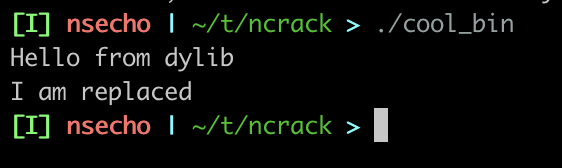

# ncrack or Cracking using LC_REEXPORT_DYLIB

In a situations where we would like only to replace the specific symbols or methods in ObjC world, 
we can utilize `LC_REEXPORT_DYLIB` load command.

This load command allows us to load a specific library; if that specific library does not have some symbols 
we can find them somewhere else(in exported library).

To demonstrate the usage, we can use the following code.

__main.c:__

```c
#include <stdio.h>

extern void hello_from_the_library(void);
extern void to_replace(void);

int main(void)
{
    hello_from_the_library();
    to_replace();
    return 0;
}

```

__library.c:__

```c
#include <stdio.h>

void hello_from_the_library(void)
{
    printf("Hello from dylib\n");
}

void to_replace(void)
{
    printf("I am not replaced\n");
}
```

__Makefile:__

```makefile
all:
	@gcc -o libcool_lib.dylib -dynamiclib library.c
	@gcc main.c -o cool_bin -L. -lcool_lib
```

Running `make` followed with `./cool_bin` gives us the following output which is expected.

```bash
$ ./cool_bin
Hello from dylib
I am not replaced
```

Let's now say that we want to only replace `to_replace` function inside the `libcool_lib.dylib`. 

The code for that is pretty simple.

__replacer.c:__

```c
#include <stdio.h>

void to_replace(void)
{
    printf("I am replaced\n");
}
```

Now, we cant just blindly compile this code as dynamic library, because once the application 
tries to load the dylib, it will fail resolving the symbol.

```bash
dyld[7150]: Symbol not found: _hello_from_the_library
  Referenced from: <339A7448-1A2C-315F-AE36-6AA56B30F1D8> /Users/demon/tools/ncrack/cool_bin
  Expected in:     <E1CAFA7D-FAF0-3330-BAE2-2EB4F0D34994> /Users/demon/tools/ncrack/libcool_lib.dylib
fish: Job 1, './cool_bin' terminated by signal SIGABRT (Abort)
```

To overcome this, we can build our new dylib with `LC_REEXPORT_DYLIB` that points to our original dylib.

But, before we compile it, let's rename the original library to `_libcool_lib.dylib`.

```bash
$ gcc -o libcool_lib.dylib -dynamiclib replacer.c -Xlinker -reexport_library /Users/demon/tools/ncrack/_libcool_lib.dylib
```

Running `otool -l` on this new library confirms that we have added `LC_REEXPORT_DYLIB` to it.

```bash
$ otool -l ./libcool_lib.dylib | grep LC_REEXPORT -A5
          cmd LC_REEXPORT_DYLIB
      cmdsize 48
         name libcool_lib.dylib (offset 24)
   time stamp 2 Thu Jan  1 01:00:02 1970
      current version 0.0.0
compatibility version 0.0.0
```

The only thing left is that we need to tell the binary where to actually find this new library. We can do that using `install_name_tool`.

Make sure to provide full paths while compiling the new library as well as when calling `install_name_tool`.

```bash
$ # install_name_tool -change NAME OLD NEW
$ install_name_tool -change libcool_lib.dylib \
  /Users/demon/tools/ncrack/_libcool_lib.dylib \
  /Users/demon/tools/ncrack/libcool_lib.dylib
```

Running the binary now shows that the binary has called our new function.



We can do the same thing with ObjC methods using [method swizzling](https://www.dylib.zip/posts/cracking_macos.html) with `LC_REEXPORT_DYLIB` trick. 
Sample code is given in [objc](./objc) directory.